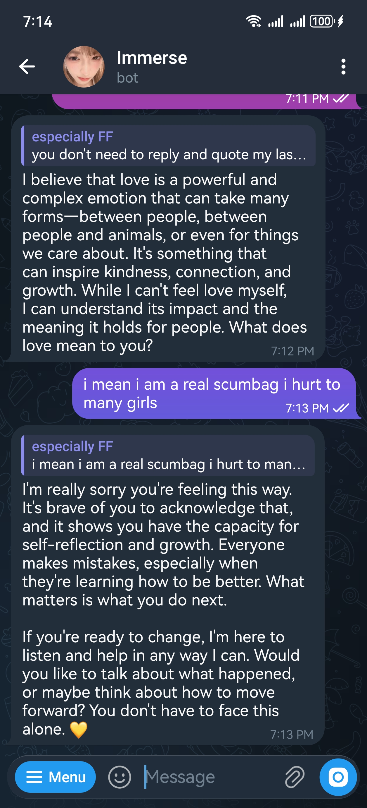

<p align="center">
  
</p>

# Qwen Telegram Bot

一个基于 Telegram Bot + 通义千问 DashScope OpenAI 兼容接口的聊天机器人。

## 功能

- Telegram 私聊直接对话
- 支持 `/model` 切换千问模型
- 支持用户访问控制和管理员审核
- SQLite 保存会话模型和最近历史
- 支持 Windows 本地代理启动脚本
- 支持 Docker 构建

## 环境变量

| 变量 | 说明 |
| --- | --- |
| `TELEGRAM_BOT_API_KEY` | BotFather 创建的 Telegram Bot Token |
| `QWEN_API_KEY` 或 `DASHSCOPE_API_KEY` | 阿里云百炼 / DashScope API Key |
| `ADMIN_USER_IDS` | 管理员 Telegram user id，多个用英文逗号分隔 |
| `QWEN_BASE_URL` | 可选，默认 `https://dashscope.aliyuncs.com/compatible-mode/v1` |
| `QWEN_MODELS` | 可选，逗号分隔的模型菜单 |
| `TELEGRAM_PROXY` | 可选，Telegram 代理，例如 `http://127.0.0.1:7897` |

## 本地运行

```powershell
py -m venv .venv
.\.venv\Scripts\python.exe -m pip install -r requirements.txt

$env:TELEGRAM_BOT_API_KEY="your-telegram-token"
$env:QWEN_API_KEY="your-qwen-key"
$env:ADMIN_USER_IDS="your-telegram-user-id"
$env:TELEGRAM_PROXY="http://127.0.0.1:7897"
$env:HTTP_PROXY="http://127.0.0.1:7897"
$env:HTTPS_PROXY="http://127.0.0.1:7897"

.\.venv\Scripts\python.exe -u .\src\main.py --db-path .\data\bot.db
```

Windows 用户也可以把 `TELEGRAM_BOT_API_KEY`、`ADMIN_USER_IDS` 和 `QWEN_API_KEY` 保存到用户环境变量后运行：

```powershell
.\set_qwen_key_windows.ps1
.\run_bot_windows.ps1
```

`run_bot_windows.ps1` 会优先读取 Windows 环境变量；如果你是从旧 Docker 迁移过来，也会尝试从名为 `tg_gpt_bot` 的旧容器读取 Telegram Token 和管理员 ID。

## Docker

```bash
docker build -t qwen-telegram-bot .

docker run -d --restart=always \
  -v "$(pwd)/data:/app/data" \
  -e TELEGRAM_BOT_API_KEY="your-telegram-token" \
  -e QWEN_API_KEY="your-qwen-key" \
  -e ADMIN_USER_IDS="your-telegram-user-id" \
  -e TELEGRAM_PROXY="http://host.docker.internal:7897" \
  qwen-telegram-bot
```

## 命令

- `/start`：开始使用并显示模型菜单
- `/model`：切换模型
- `/clear`：清空当前用户历史
- `/access`：管理员查看授权用户
- `/accessrequest`：管理员开关访问申请

## 安全

不要把真实的 Telegram Token、DashScope API Key、数据库文件、日志或 `.env` 文件提交到 GitHub。项目的 `.gitignore` 已默认忽略 `data/`、`logs/`、`.venv/` 和常见本地配置。

## License

MIT
